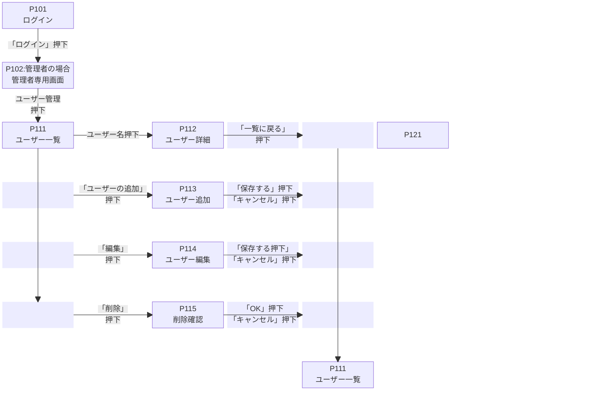

進捗度65%（2025-10-13)
# 忘れ物管理システム(仮名)
---
## 概要
ある施設(会社)の顧客の忘れ物を管理する
## 機能
- 一般社員、管理者の2種類のユーザーを想定し、ログイン画面は共通とし、ID,パスワードを照合し、それぞれのユーザーにより、以下機能が存在する。 
共通のログイン
F101ユーザー認証ログインIDとパスワードによるユーザー認証
管理者機能

- 使用者登録メンテナンス:使用者、管理者登録、編集、削除(管理者のみ)
- 忘れ物の項目名のメンテナンス:追加、編集、削除(管理者のみ)
- 忘れ物の状態のメンテナンス:追加、編集、削除(管理者のみ)
- 保管場所のメンテナンス:追加、編集、削除(管理者のみ)
- 忘れ物の閲覧、登録、編集、状態変更、削除は、管理者のみ
- 忘れ物データの部分一括削除(管理者のみ)
- ログアウト

### 画面遷移図

## 画面モックアップ

## データベース概要
### データベース名:lostItem_db
| テーブル名      | 概要                    |
|:---------------------|:------------------------|
| items            | 忘れ物の一覧。ID,忘れ物の         |
| items_details        | 忘れ物の詳細。Itemsテーブルと連携するための忘れ物ID,忘れ物
の名前,         |
| Item_Types       | 忘れ物の種類         |
| findLocation_Types   | 発見場所の種類         |
| findPersonDepa_Types | 発見者の部署の種類 |
| location_Types       | 保管場所の種類           |
| status_Types         | 忘れ物状態の種類 |
| admins              | 管理者データを保存 |
| users                | 登録利用者の保存テーブル |
| department_Types     | 利用者の所属部署の種類 |
***

### テーブル概要
#### items
| カラム名        | 型        | PRIMARY KEY | NOT NULL | UNIQUE | AUTO_INCREMENT | DEFALT |
|:---------------|:----------|:-----------:|:--------:|:------:|:--------------:|:------:|
|id              |INT        |〇           |〇        |        |  〇            |         |
|name            |VARCHAR(20)|             |〇        |        |                |         |
|location_id     |INT        |             |〇        |        |                |         |
|find_date       |DATETIME   |             |〇        |        |                |         |
|department_id   |INT        |             |〇        |        |                |         |
|find_person_name|VARCHAR(10)|             |〇        |        |                |         |
|status_id       |INT        |             |〇        |        |                |         |
|register_id     |INT        |             |〇        |        |                |         |
|register_date   |DATETIME   |             |〇        |        |                |         |

#### item_details
| カラム名  | 型        | PRIMARY KEY | NOT NULL | UNIQUE | AUTO_INCREMENT | DEFALT |
|:---------|:----------|:-----------:|:--------:|:------:|:--------------:|:------:|
|item_id        |INT        |〇           |〇        |        |  〇            |         |
|login_id  |VARCHAR(20)|             |〇        |〇      |                |         |
|login_pass|CHAR(60)   |             |〇        |        |                |         |

#### admin
| カラム名  | 型        | PRIMARY KEY | NOT NULL | UNIQUE | AUTO_INCREMENT | DEFALT |
|:---------|:----------|:-----------:|:--------:|:------:|:--------------:|:------:|
|id        |INT        |〇           |〇        |        |  〇            |         |
|login_id  |VARCHAR(20)|             |〇        |〇      |                |         |
|login_pass|CHAR(60)   |             |〇        |        |                |         |

#### users
| カラム名  | 型        | PRIMARY KEY | NOT NULL | UNIQUE | AUTO_INCREMENT | DEFALT |
|:---------|:----------|:-----------:|:--------:|:------:|:--------------:|:------:|
|id        |INT        |〇           |〇        |        |  〇            |         |
|login_id  |VARCHAR(20)|             |〇        |〇      |                |         |
|login_pass|CHAR(60)   |             |〇        |        |                |         |

## 補足
